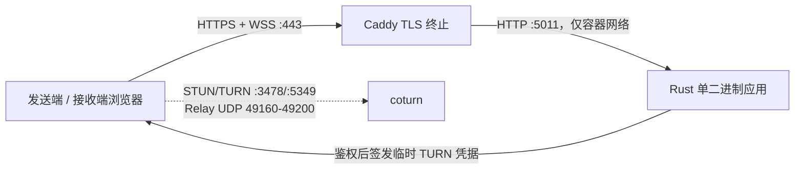

# Production Deployment Runbook

本文档描述仓库已准备好的生产部署流程。它尚未表示任何公网环境已经上线：腾讯云服务器、DNS、证书、防火墙、TURN 和监控必须等用户提供服务器连接后再执行和验证。

## 1. 拓扑与边界



应用保持无状态：房间、成员和信令队列只在内存中；视频不经过应用或 Caddy。重启会关闭当前会话，客户端收到 1012 后需要重新连接。

## 2. 前置条件

- 64 位 Linux 主机，推荐至少 2 vCPU、2 GiB 内存；TURN 带宽按预期并发单独估算。
- Docker Engine 和 Docker Compose v2；systemd 路线还需要预先安装 Caddy 与 coturn。
- `APP_DOMAIN` 和 `TURN_DOMAIN` 的 A/AAAA 记录已指向服务器；上线前降低 DNS TTL 便于回滚。
- 服务器时间同步正常。临时 TURN 凭据依赖双方时钟。
- 已规划 TLS 证书续期。Caddy 自动管理应用域名证书；coturn 的证书/私钥通过主机只读挂载并需要独立续期钩子。

## 3. 网络与防火墙

云安全组和主机防火墙必须同时配置，且只开放实际启用的协议：

| 端口 | 协议 | 用途 |
| --- | --- | --- |
| 80 | TCP | ACME HTTP challenge 与 HTTPS 跳转 |
| 443 | TCP | HTTPS 与 WebSocket |
| 443 | UDP | Caddy HTTP/3，可按策略关闭 |
| 3478 | TCP/UDP | STUN/TURN |
| 5349 | TCP | TURN over TLS |
| 49160–49200 | UDP | coturn 有界媒体 relay 端口 |

不要把应用的 5011 端口暴露到公网。SSH 管理端口只允许可信源地址；公网管理策略在腾讯云执行阶段单独确认。

## 4. 密钥与环境文件

复制示例并设置权限：

```bash
cp .env.example .env
chmod 600 .env
python -X utf8 -c "import secrets; print(secrets.token_urlsafe(48))"
```

分别生成 `METRICS_TOKEN` 和 `TURN_SHARED_SECRET`，不能复用。填写域名、ACME 邮箱、coturn 公网/私网映射和证书绝对路径。`TURN_EXTERNAL_IP` 在公网地址直接绑定到主机时填公网 IP；经过 1:1 NAT 时使用 `PUBLIC_IP/PRIVATE_IP`。

密钥应来自云密钥管理、root-only 环境文件或容器 secret。不要提交 `.env`，不要把值写进镜像、Compose 文件、Issue、终端截图或普通监控标签。

## 5. Compose 首次部署

先渲染并审查最终配置，再构建和启动：

```bash
docker compose -f compose.example.yml --env-file .env config
docker compose -f compose.example.yml --env-file .env build --pull app
docker compose -f compose.example.yml --env-file .env pull caddy coturn
docker compose -f compose.example.yml --env-file .env up -d
docker compose -f compose.example.yml --env-file .env ps
```

模板使用固定的 Bun 1.3.14、Rust 1.97.0、Caddy 2.11.4 和 coturn 4.14.0-r0 标签。升级镜像前阅读上游发行说明，并在测试环境重新执行浏览器 E2E、冒烟和 TURN relay 验收。

## 6. 首次验收

在服务器本机检查容器和应用：

```bash
docker compose -f compose.example.yml --env-file .env ps
set -a && . ./.env && set +a
curl --fail --silent --show-error "https://$APP_DOMAIN/health"
curl --fail --silent --show-error "https://$APP_DOMAIN/ready"
curl --fail --silent --show-error \
  --header "Authorization: Bearer $METRICS_TOKEN" \
  "https://$APP_DOMAIN/metrics"
```

随后从至少两个不同公网网络执行：

1. 打开发送端，允许摄像头，确认预览出现；
2. 复制 Fragment 中含访问码的接收链接，确认访问码没有进入 HTTP 日志；
3. 接收端加入，确认双方显示已连接且视频持续播放；
4. 使用浏览器 WebRTC internals 或 ICE candidate 工具确认出现 `relay` candidate；
5. 临时限制直连网络或在受限网络测试，确认媒体确实能经过 coturn；
6. 重启应用，确认客户端收到可操作的“服务正在重启”提示且旧房间被清理。

只看到 `host` 或 `srflx` candidate 不算 TURN 验收成功。

## 7. 监控与告警

外部探针每 30 秒检查 `/health` 和 `/ready`。`/metrics` 必须携带 Bearer Token，并至少采集：

- `connections`、`rooms`、`peers` 接近配置上限；
- `queuedSignalBytes` 持续非零或增长；
- `outboundOverloads`、`rateLimitedConnections`、`connectionRejections` 增量；
- `authenticationFailures`、`authenticationBlocks` 异常增长；
- `turnCredentialRejections` 增量；
- 进程/容器 CPU、RSS、重启次数、文件描述符和主机网络流量；
- coturn allocation 数、拒绝、relay 带宽、丢包和端口池使用率。

建议 `/ready` 连续两次失败即告警；容量超过 80%、队列连续 2 分钟非零、拒绝或过载指标持续增长应告警。阈值需根据上线后的正常基线调整。

## 8. 日志与隐私

```bash
docker compose -f compose.example.yml --env-file .env logs --since=30m app caddy coturn
```

日志可以包含房间 ID、peer ID、来源 IP 和请求 ID，但不应包含访问码、完整接收 URL、TURN shared secret、临时 credential 或指标 Token。把请求 ID 作为 HTTP 与应用日志的关联键；对外分享前先脱敏 IP、域名和房间标识。

## 9. TURN 故障诊断

按以下顺序检查，避免先修改 WebRTC 客户端：

1. DNS 是否解析到正确公网地址，证书 SAN 是否包含 `TURN_DOMAIN`；
2. 3478 TCP/UDP、5349 TCP、49160–49200 UDP 是否同时通过云安全组与主机防火墙；
3. `TURN_EXTERNAL_IP` 是否符合公网直连或 `PUBLIC_IP/PRIVATE_IP` 映射；
4. 应用和 coturn 的 `TURN_SHARED_SECRET` 是否一致，主机时间是否同步；
5. coturn 健康检查、allocation 日志、配额和带宽是否正常；
6. 浏览器是否收到带有效期的临时用户名/credential，以及 candidate pair 最终是否为 relay。

详见 [`deploy/coturn/README.md`](../deploy/coturn/README.md)。

## 10. 升级与回滚

升级前保存当前 Git 提交、镜像 ID、`.env` 权限和外部监控状态。先执行：

```bash
bun install --frozen-lockfile
cargo xtask verify
cargo xtask e2e
python -X utf8 scripts/soak.py --receivers 2 --duration 300 --output target/soak/predeploy
cargo xtask release
cargo xtask smoke -- target/release/webrtc-camera-share-server
```

soak 输出中的 `summary.json` 必须保持脱敏，只用于核对连接状态、服务计数和 RTCStats；不要把生产密钥作为命令参数或写入测试制品。Compose 部署使用新的不可变 `APP_IMAGE_TAG` 构建，不要覆盖仍在回滚窗口内的旧标签。启动后验证 `/ready`、受保护指标、一个真实 WebRTC 会话和 TURN relay，再清理旧镜像。

回滚时恢复上一镜像标签和对应环境配置，运行 `docker compose ... up -d`，再重复健康、指标和会话验收。服务没有数据库或持久化房间，因此没有业务数据备份；需要备份的是加密存储中的密钥、证书续期配置、部署清单、告警规则和发布制品校验值。

## 11. 事件响应

- 凭据泄露：立即轮换对应 secret。轮换 TURN secret 会使现有临时凭据失效，安排短暂会话中断。
- 异常流量或配额耗尽：限制来源、检查安全组、调低连接/房间/带宽上限，保留脱敏日志。
- `/ready` 失败：从负载入口摘除实例，检查静态资源、进程和最近发布；必要时回滚。
- TURN 中继不可用：保持应用在线但明确告知复杂 NAT 用户受影响，优先恢复端口、证书和 external-IP 映射。
- 发现漏洞：遵循 [`SECURITY.md`](../SECURITY.md)，不要公开披露未修复细节。

## 12. systemd 二进制部署

不使用容器时，将内嵌二进制安装到 `/usr/local/bin`，创建无登录用户和 `/etc/webrtc-camera-share/app.env`，复制示例 unit 后执行：

```bash
sudo systemctl daemon-reload
sudo systemctl enable --now webrtc-camera-share
sudo systemctl status webrtc-camera-share
sudo -u webrtc-camera-share /usr/local/bin/webrtc-camera-share-server --healthcheck
```

`app.env` 只包含应用支持的变量：`HOST=127.0.0.1`、`PORT=5011`、容量、Origin、指标和 TURN 配置。Caddy 与 coturn 仍需各自的受管服务、证书和防火墙策略。

## 13. 腾讯云待执行清单

收到服务器连接后再执行以下动作，并逐项保留命令与证据：

- 核对实例规格、系统、磁盘、已有服务、SSH 登录与回滚通道；
- 配置安全组和主机防火墙，不覆盖未知现有规则；
- 核对公网/私网 IP、DNS 解析与域名所有权；
- 安装或验证 Docker/Compose，部署固定提交与校验过的制品；
- 配置 Caddy HTTPS、coturn TLS、secret、日志轮换和系统时间；
- 验证健康、指标保护、WebSocket Origin、真实摄像头和跨网络 relay；
- 执行短时 1/2/4/8 接收端验证与长稳测试；
- 接入监控与告警，记录最终版本、端口、域名、证书到期和回滚命令。

在这些步骤完成前，项目状态应表述为“仓库内生产准备完成，公网部署待服务器访问”，不能称为已上线。
